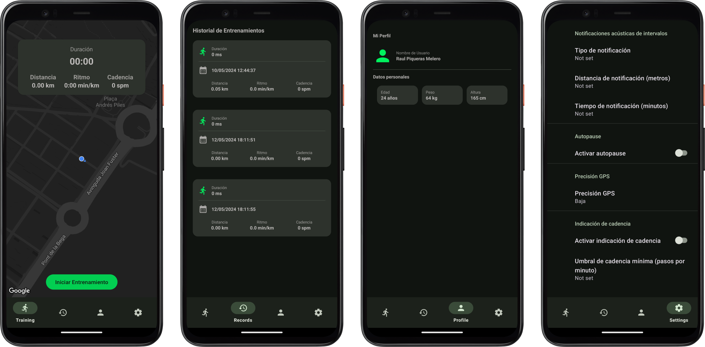
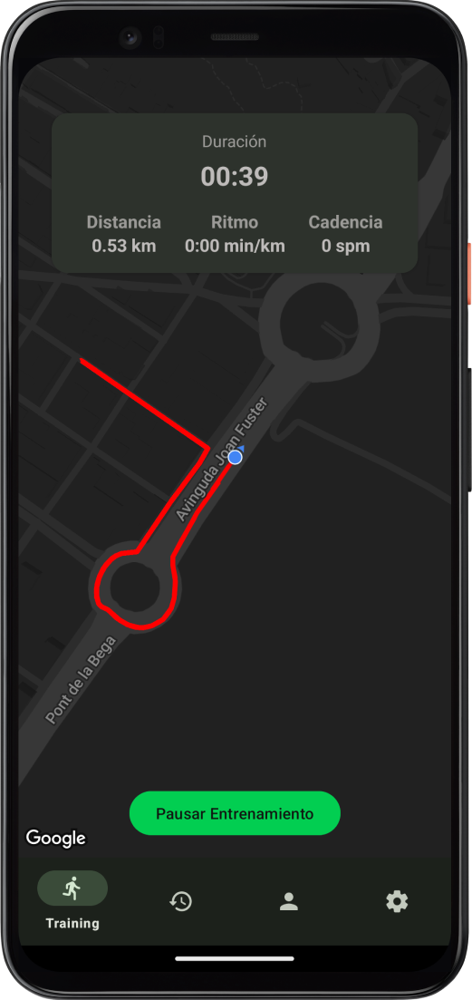

# RunTracker



# Raúl Piqueras Melero

# Descripción
RunTracker es una aplicación para Android que permite a los usuarios realizar un seguimiento de sus entrenamientos de carrera.

# Dificultades encontradas y cómo se resolvieron

Durante el desarrollo de este proyecto, encontré algunas dificultades que tuve que superar para completar la aplicación. Una de las principales dificultades fue la implementación del sensor de pasos, ya que no funcionaba correctamente en el simulador. Para solucionarlo, tuve que probar la aplicación en un dispositivo físico y realizar pruebas sin tener la consola disponible en tiempo real.

Además, tuve que buscar documentación sobre cómo implementar vistas de mapas en Android y cómo trabajar con notificaciones.

## Características

### Registro de la actividad y carga del mapa de Google Maps

Se implementa el callback `OnMapReadyCallback` en el fragmento `TrainingFragment` y se utiliza un `LocationCallback` para recibir actualizaciones de ubicación.

#### Implementación del callback `OnMapReadyCallback`:

```kotlin
class TrainingFragment : Fragment(), OnMapReadyCallback, SensorEventListener {
    ...
}
```

### Carga del mapa y configuración

En el método `onViewCreated`, simplemente cargamos el mapa y asignamos su configuración.

```kotlin
override fun onViewCreated(view: View, savedInstanceState: Bundle?) {
    super.onViewCreated(view, savedInstanceState)
  
    // Carga del mapa
    mapFragment = (childFragmentManager.findFragmentById(R.id.fragment_map) as SupportMapFragment?)!!
    mapFragment.getMapAsync(this)
}
```

```kotlin
// Método llamado cuando el mapa está listo
@SuppressLint("MissingPermission")
override fun onMapReady(googleMap: GoogleMap) {
    this.googleMap = googleMap
  
    // Habilitar la ubicación del usuario en el mapa
    this.googleMap.isMyLocationEnabled = true
  
    // Establecer el estilo del mapa
    this.googleMap.setMapStyle(
        MapStyleOptions.loadRawResourceStyle(
            this.requireContext(),
            R.raw.map_style_night
        )
    )
  
    // Ocultar el botón de ubicación del usuario
    mapFragment.view?.findViewWithTag<ImageView>("GoogleMapMyLocationButton")?.visibility = View.GONE;
  
    // Establecer el color de fondo del mapa
    mapFragment.view?.setBackgroundColor(resources.getColor(R.color.md_theme_inverseOnSurface))
  
    // Iniciar actualizaciones de ubicación
    startLocationUpdates()
}
```

### Funcionalidad Core de la Aplicación

En este apartado es donde se reciben las actualizaciones de ubicación del dispositivo móvil. Aquí también se actualizan todas las etiquetas de distancia, cadencia, se comprueba la configuración de la aplicación, se lanzan las notificaciones acústicas, entre otras funciones.

```kotlin
 private val locationCallback = object : com.google.android.gms.location.LocationCallback() {
        override fun onLocationResult(locationResult: com.google.android.gms.location.LocationResult) {
            super.onLocationResult(locationResult)
            Log.d("My Location", "Location Updated")
            currentLocation = LatLng(locationResult.lastLocation!!.latitude, locationResult.lastLocation!!.longitude)
            currentLocation?.let {

                googleMap.animateCamera(CameraUpdateFactory.newLatLngZoom(it, 17f))

                if (isRunning){

                    if (!isPaused){

                        routePausedPoints.clear()
                        routePoints.add(it)
                        updateRoute()

                        if (lastLocation != null) {
                            totalDistance += distanceBetween(lastLocation!!, it)
                            totalDistanceNotification += distanceBetween(lastLocation!!, it)

                            when(getNotificationTypeFromSharedPreference()){
                                0 -> {
                                    if (totalDistanceNotification > PreferenceManager.getDefaultSharedPreferences(requireContext()).getInt("distance_notification", 1000)){
                                        totalDistanceNotification = 0.0
                                        requireContext().showNotification("Aviso de metros", "Has alcanzado tu marca de aviso")
                                    }
                                }
                                1 -> {
                                    val myTime = PreferenceManager.getDefaultSharedPreferences(requireContext()).getInt("time_notification", 2)

                                    if (getCurrentTimeMinutes().toInt() != 0){
                                        if (getCurrentTimeMinutes() > (lastNotificationTime + (myTime - 1))) {
                                            val title = "Título de la notificación"
                                            val body = "El cronómetro ha alcanzado ${getCurrentTimeMinutes()} minutos"
                                            requireContext().showNotification(title, body)

                                            lastNotificationTime = getCurrentTimeMinutes().toInt()
                                        }
                                    }
                                }
                            }

                            binding.textViewDistance.text = "${String.format("%.2f", totalDistance/1000)} km"
                        }

                    }else{
                        routePoints.clear()
                        routePausedPoints.add(it)
                        updatePausedRoute()
                    }

                    println("Last Location Update")
                    lastLocation = it
                    if (PreferenceManager.getDefaultSharedPreferences(requireContext()).getBoolean("autopause", false)){
                        if (!isPaused){
                            checkAutopause(it)
                        }
                    }
                }
            }
        }
    }

```

### Visualización de la ruta en un mapa.

Justo con cada actualización de ubicación vamos dibujando la ruta en el mapa. (Siempre que se este realizando una actividad)

```kotlin
    private fun updateRoute() {
        googleMap.addPolyline(PolylineOptions().addAll(routePoints).color(Color.RED))
    }

    private fun updatePausedRoute() {
        googleMap.addPolyline(PolylineOptions().addAll(routePausedPoints).color(Color.TRANSPARENT))
    }
```



### Detener, reanudar y resetear el entrenamiento

```kotlin
binding.btnStartStop.setOnClickListener {
    if (isRunning) {
        if (isPaused) {
            resumeTraining()
        } else {
            stopTraining()
        }
    } else {
        startTraining()
    }
}
```

- Iniciar entrenamiento: Al hacer clic en el botón de inicio, se inicia el entrenamiento.
- Detener entrenamiento: Si el entrenamiento está en marcha, al hacer clic en el botón de parada, se detiene el entrenamiento. Si el entrenamiento está pausado, al hacer clic en el botón de     parada, se reanuda el entrenamiento.
- Reanudar entrenamiento: Si el entrenamiento está pausado, al hacer clic en el botón de inicio, se reanuda el entrenamiento.

```kotlin
private fun resetTraining() {
    CoroutineScope(Dispatchers.IO).launch {
        val entrenamiento = Entrenamiento(
            tiempo = totalTrainingTime.toLong(),
            distancia = totalDistance,
            ritmo = rhythm.toDouble(),
            cadencia = cadence,
            fecha = System.currentTimeMillis()
        )
        RunTrackerApp.database.entrenamientoDao().insert(entrenamiento)
    }
    resetUserInterface()
}

private fun resetUserInterface() {
    isRunning = false
    isPaused = true
    binding.textViewDistance.text = "0.00 km"
    binding.textViewCadence.text = "0 spm"
    binding.textViewRhythm.text = "0:00 min/km"
    binding.btnStartStop.text = "Iniciar Entrenamiento"
    googleMap.clear()
    routePoints.clear()
    binding.chronometer.base = SystemClock.elapsedRealtime()
    binding.chronometer.stop()
    routePolyline = null
    totalDistance = 0.0
    totalDistanceNotification = 0.0
    cadence = 0
    pauseOffset = 0
    lastNotificationTime = 0
    rhythm = 0
    totalTrainingTime = 0
    stopLocationUpdates()
    sensorManager.unregisterListener(this)
}
```

- Resetear entrenamiento: Al hacer clic prolongado en el botón de inicio, se muestra un cuadro de diálogo de confirmación para resetear el entrenamiento. Si se confirma, se detiene el entrenamiento y se guarda en la base de datos. Además, se restablece la interfaz de usuario y se borran todos los datos del entrenamiento actual.

### Autopause

El modo autopause es una característica que permite pausar automáticamente el entrenamiento cuando el usuario no está en movimiento. La aplicación verifica periódicamente la ubicación del usuario y, si no detecta movimiento durante un período de tiempo específico, pausa el entrenamiento automáticamente.

#### Implementación

Para implementar el autopause, seguimos los siguientes pasos:

1. Verificar si el autopause está activado en la configuración de la aplicación.

```kotlin
if (PreferenceManager.getDefaultSharedPreferences(requireContext()).getBoolean("autopause", false)) {
    if (!isPaused) {
        checkAutopause(it)
    }
}
```

2. Comprobar la ubicación del usuario periódicamente y verificar si el usuario está en movimiento.

```kotlin
private fun checkAutopause(newLocation: LatLng) {
lastLocations.add(newLocation)
if (lastLocations.size > LAST_LOCATIONS_TO_CHECK) {
    lastLocations.removeAt(0)
}
if (lastLocations.size == LAST_LOCATIONS_TO_CHECK) {
    if (isUserStopped(lastLocations)) {
        stopTraining()
        lastLocations.clear()
        showToast("Autopause activado: Actividad detenida")
    }
  }
}
```

3. Si el usuario no ha cambiado su ubicación durante un período de tiempo específico, se detiene el entrenamiento y se muestra un mensaje indicando que el autopause está activado.


### Notificaciones

1. Para notificaciones basadas en distancia:
Verificamos si la distancia recorrida supera la distancia configurada para la notificación.
Si se supera la distancia configurada, mostramos una notificación.

2. Para notificaciones basadas en tiempo:
Obtenemos el intervalo de tiempo para las notificaciones desde las preferencias compartidas.
Verificamos si ha pasado el intervalo de tiempo desde la última notificación.
Si ha pasado el intervalo de tiempo, mostramos una notificación y actualizamos el último tiempo de notificación.


Junto con las actualziaciones de cada ubicación:

```kotlin
when(getNotificationTypeFromSharedPreference()){
    0 -> {
        // Verificar si se ha alcanzado la distancia para la notificación
        if (totalDistanceNotification > PreferenceManager.getDefaultSharedPreferences(requireContext()).getInt("distance_notification", 1000)){
            // Reiniciar el contador de distancia
            totalDistanceNotification = 0.0
            // Mostrar la notificación
            requireContext().showNotification("Aviso de metros", "Has alcanzado tu marca de aviso")
        }
    }
    1 -> {
        // Obtener el intervalo de tiempo de las preferencias compartidas
        val myTime = PreferenceManager.getDefaultSharedPreferences(requireContext()).getInt("time_notification", 2)
        
        // Verificar si ha pasado el intervalo de tiempo para la notificación
        if (getCurrentTimeMinutes().toInt() != 0){
            if (getCurrentTimeMinutes() > (lastNotificationTime + (myTime - 1))) {
                // Mostrar la notificación
                val title = "Título de la notificación"
                val body = "El cronómetro ha alcanzado ${getCurrentTimeMinutes()} minutos"
                requireContext().showNotification(title, body)
                
                // Actualizar el último tiempo de notificación
                lastNotificationTime = getCurrentTimeMinutes().toInt()
            }
        }
    }
}
```

3. Para notificaciones basadas en Cadencia:

Dentro de las actualizaciones de los pasos comprobamos

```kotlin
if (PreferenceManager.getDefaultSharedPreferences(requireContext()).getBoolean("cadence_notification", false)){
         if (cadence >= PreferenceManager.getDefaultSharedPreferences(requireContext()).getInt("cadence_threshold", 500) ) {
                requireContext().showNotification("Aviso de Cadencia", "Has alcanzado tu marca de aviso")
        }
}
```

## Sensor de Pasos y Cadencia

1. Sensor de pasos:

Este código escucha los eventos generados por el sensor de pasos del dispositivo. El sensor de pasos proporciona datos sobre el número de pasos detectados por el dispositivo.

2. Cadencia (Pasos por minuto - spm):

La cadencia es la cantidad de pasos que una persona da en un minuto. Para calcular la cadencia, dividimos el número de pasos detectados desde el último evento por el tiempo transcurrido desde ese evento, y luego multiplicamos por 60000 para convertirlo a pasos por minuto (ya que el tiempo se mide en milisegundos).

```kotlin
override fun onSensorChanged(event: SensorEvent?) {
    event?.let {
        if (it.sensor == stepSensor) { // Verifica si el evento proviene del sensor de pasos
            if (isRunning) { // Verifica si el entrenamiento está en curso
                if (!isPaused) { // Verifica si el entrenamiento no está pausado
                    val currentTime = System.currentTimeMillis() // Obtiene el tiempo actual en milisegundos
                    val steps = it.values[0].toInt() - totalSteps // Calcula el número de pasos desde el último evento
                    val elapsedTime = currentTime - lastStepTime // Calcula el tiempo transcurrido desde el último evento

                    if (elapsedTime > 0) {
                        // Calcula la cadencia (pasos por minuto)
                        val cadence = ((steps * 60000) / elapsedTime).toInt()
                        binding.textViewCadence.text = "$cadence spm" // Actualiza la vista con la cadencia
                        lastStepTime = currentTime // Actualiza el tiempo del último evento de paso
                        totalSteps += steps // Actualiza el total de pasos
                    }
                    Log.d("Pasos", totalSteps.toString()) // Registra el número total de pasos en el registro
                }
            }
        }
    }
}
```

## Historial

En la pestaña "Historial" de la aplicación RunTracker, se muestra una lista de todos los entrenamientos realizados por el usuario. Para almacenar y gestionar estos datos, hemos implementado una base de datos utilizando Room, que es una capa de abstracción sobre SQLite.

### Implementación de la base de datos con Room

Hemos creado una base de datos que contiene una tabla para almacenar los datos de los entrenamientos. Cada entrenamiento se representa como una entidad en la base de datos. A continuación se muestra un resumen de la implementación:

```kotlin
@Entity(tableName = "entrenamientos")
data class Entrenamiento(
    @PrimaryKey(autoGenerate = true) val id: Long = 0,
    val tiempo: Long, // en milisegundos
    val distancia: Double, // en metros
    val ritmo: Double, // minutos por kilómetro
    val cadencia: Int, // pasos por minuto
    val fecha: Long // timestamp del inicio del entrenamiento
)

@Dao
interface EntrenamientoDao {
    @Insert
    suspend fun insert(entrenamiento: Entrenamiento)

    @Query("SELECT * FROM entrenamientos")
    suspend fun getAllEntrenamientos(): List<Entrenamiento>
}

@Database(entities = [Entrenamiento::class], version = 1)
abstract class EntrenamientoDatabase : RoomDatabase() {
    abstract fun entrenamientoDao(): EntrenamientoDao
}

```

### Visualización de los entrenamientos en el RecyclerView

Para mostrar los entrenamientos almacenados en la base de datos, utilizamos un RecyclerView en la ventana de historial. A continuación se muestra un resumen de la implementación:

```kotlin
class RecordFragment : Fragment() {

    // Inicialización del RecyclerView y el adaptador
    private lateinit var binding: FragmentRecordBinding
    private lateinit var trainingAdapter: TrainingAdapter

    override fun onCreateView(
        inflater: LayoutInflater, container: ViewGroup?,
        savedInstanceState: Bundle?
    ): View? {
        binding = FragmentRecordBinding.inflate(inflater, container, false)
        return binding.root
    }

    override fun onViewCreated(view: View, savedInstanceState: Bundle?) {
        super.onViewCreated(view, savedInstanceState)

        trainingAdapter = TrainingAdapter(emptyList())
        binding.recyclerViewTraining.apply {
            adapter = trainingAdapter
            layoutManager = LinearLayoutManager(requireContext())
        }

        // Cargar los entrenamientos al RecyclerView
        loadTrainings()
    }

    // Método para cargar los entrenamientos desde la base de datos
    private fun loadTrainings() {
        CoroutineScope(Dispatchers.IO).launch {
            val trainings = RunTrackerApp.database.entrenamientoDao().getAllEntrenamientos()
            withContext(Dispatchers.Main) {
                updateTrainingList(trainings)
            }
        }
    }

    // Método para actualizar la lista de entrenamientos en el RecyclerView
    private fun updateTrainingList(trainings: List<Entrenamiento>) {
        trainingAdapter.trainingList = trainings
        trainingAdapter.notifyDataSetChanged()
    }

}
```

- **Perfil:**
  - En la pestaña "Perfil", se muestra toda la información del usuario, incluyendo:
    - Nombre
    - Foto
    - Sexo
    - Edad
    - Peso
    - Altura

## Opciones

Las opciones de configuración de RunTracker se pueden acceder a través de la pestaña "Opciones" en la aplicación. Estas opciones se han implementado utilizando SharedPreferences y se pueden modificar según las preferencias del usuario. A continuación se describen las opciones disponibles:

### Notificaciones acústicas de intervalos

- **Tipo de notificación:** El usuario puede elegir el tipo de notificación para los intervalos. Puede ser por distancia o por tiempo.
- **Distancia de notificación (metros):** El usuario puede configurar la distancia a la que desea recibir las notificaciones de intervalos, si ha elegido la notificación por distancia.
- **Tiempo de notificación (minutos):** El usuario puede configurar el intervalo de tiempo para recibir las notificaciones, si ha elegido la notificación por tiempo.

### Autopause

- **Activar autopause:** El usuario puede activar esta opción para que la aplicación pausa automáticamente el entrenamiento cuando detecta que el usuario está parado.

### Precisión GPS

- **Precisión GPS:** El usuario puede seleccionar el nivel de precisión del GPS entre óptima, media o baja.

### Indicación de cadencia

- **Activar indicación de cadencia:** El usuario puede activar esta opción para recibir notificaciones acústicas si su cadencia está por debajo del umbral establecido.
- **Umbral de cadencia mínima (pasos por minuto):** El usuario puede configurar el umbral mínimo de cadencia para recibir las notificaciones acústicas.

Para modificar estas opciones, acceda a la pestaña "Opciones" en la aplicación RunTracker.

## Herramientas Utilizadas

- Room Database
- Android Sensor Manager
- Google Maps
- Shared Preferences

